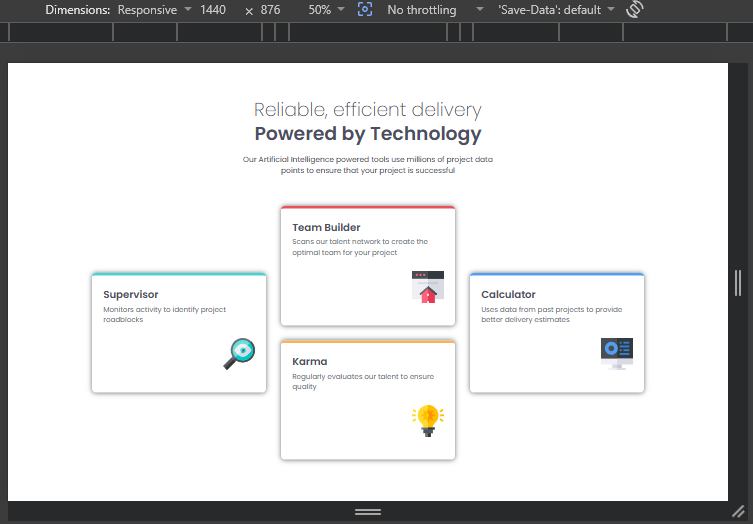
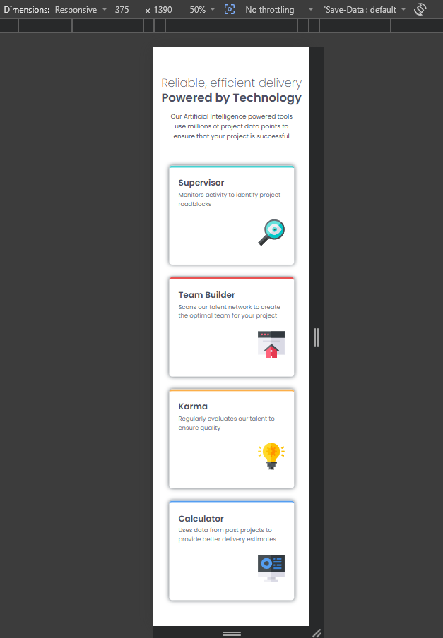

# Four card feature section

This is a solution to the [Four card feature section challenge on Frontend Mentor](https://www.frontendmentor.io/challenges/four-card-feature-section-weK1eFYK).

## Table of Contents

- [Overview](#overview)
- [Screenshot](#screenshot)
- [Links](#links)
- [Built With](#built-with)
- [What I Learned](#what-i-learned)
- [Continued Development](#continued-development)
- [Author](#author)

## Overview

A clean and modern multi-column feature section component built using html and css. The design features an asymmetric card layout with colored top-border accents, subtle box shadows, clean typography, and a responsive structure that scales smoothly from mobile devices to desktop viewports.

### Screenshot

**Desktop View**  

**Mobile View**  

## Links

- Live Site URL: [Vercel](https://four-card-feature-section-ka6z.vercel.app/)
- Solution URL: [Github](https://github.com/vo1d-bot/Four-Card-Feature-Section.git)

## Built With

- Semantic HTML5 markup inside index.html
- CSS3 style architecture inside styles.css
- Flexbox for layout alignment and nested column nesting (.card__group)
- CSS Custom Properties for uniform color scheme management
- Fluid typography utilizing the clamp() function
- Google Fonts (Poppins family)

## What I Learned
This project helped me strengthen my skills in:

- Creating asymmetric multi-row layouts using nested Flexbox column wrappers (.card__group) instead of standard grids.
- Applying explicit design details like dynamic, fluid header sizes using clamp() properties.
- Utilizing clean modifier configurations (.supervisor, .builder, .karma, .calculator) to selectively colorize the top border accents on structural cards.
- Managing fluid container limits with clamp() widths to ensure structural text elements scale naturally without overflowing baseline layouts.

## Author

- GitHub - [vo1d-bot](https://github.com/vo1d-bot)
- Frontend Mentor - [vo1d-bot](https://www.frontendmentor.io/profile/vo1d-bot)

---

**Feedback & Suggestions Welcome!**  
Feel free to leave any feedback or suggestions to help me improve.
